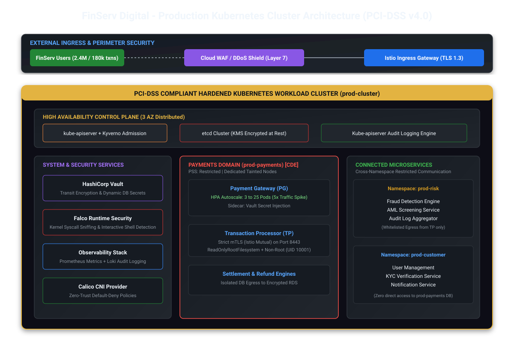

# FinServ Digital - Production Cluster Architecture

## Architecture Overview
The platform enforces physical and logical isolation across environments with dedicated node pools, high availability control planes, and zero-trust boundaries compliant with PCI-DSS v4.0.

## Node Pools & Domain Isolation
- **System Pool:** Core platform components (HashiCorp Vault, Falco, Prometheus, Loki).
- **Payments Dedicated Pool (CDE):** Tainted node pool strictly for `prod-payments` workloads.
- **General Workload Pool:** Hosting `prod-risk`, `prod-customer`, and `prod-platform` microservices.
